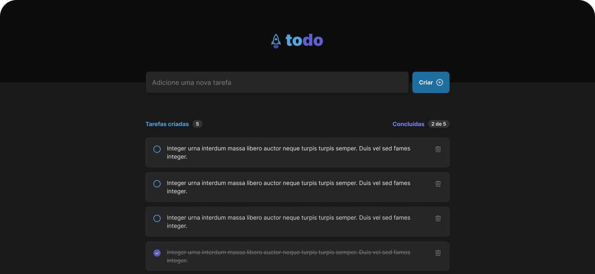
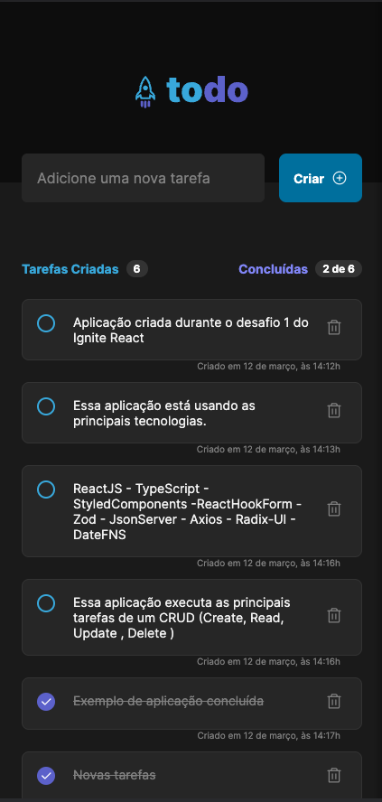

<h1 align="center"> 
	TODO REACT
</h1>

<h2 align="center">
    
</h2>


<p align="center">
 <a href="#-sobre-o-projeto">Sobre</a> •
 <a href="#-funcionalidades">Funcionalidades</a> •
 <a href="#-layout">Layout</a> • 
 <a href="#-como-executar-o-projeto">Como executar</a> • 
 <a href="#-tecnologias">Tecnologias</a> • 
 <a href="#-contribuidores">Contribuidores</a> • 
 <a href="#-autor">Autor</a> • 
 <a href="#user-content--licença">Licença</a>
</p>


## 💻 Sobre o projeto

ToDo React - é uma aplicação que executa uma lista de tarefas simples que permite, criar novas tarefas, editar caso as tarefas estejam concluídas ou não e deletar tarefas 

Esse projeto foi desenvolvido como desafio 1 do Ignite na trilha de ReactJS do curso da pela Rocketseat](https://www.rocketseat.com.br/ignite#trilhas).


---

## ⚙️ Funcionalidades

- [x] O usuário pode cadastrar suas tarefas diárias para controlar suas ações:
  - [x] Cadastrar uma nova tarefa
  - [x] Editar o status de uma tarefa criada entre concluída e não concluída
  - [x] Deletar uma tarefa existente

---

## 🎨 Layout

O layout da aplicação está disponível no Figma:

<a href="https://www.figma.com/file/LWmr2KfwECwzPhcb0jajmW/ToDo-List-(Copy)?t=3i6t08ZPhkECkgZB-1">
  
</a>


---

### Web

 


### Mobile


---

## 🚀 Como executar o projeto

💡Para executar o projeto corretamente, será necessário iniciar o JSON-Server para que as funções de cadastro possam funcionar 
1. Backend (arquivo server.json ) 
2. Frontend (pasta do projeto)

Siga os passoas abaixo para a aplicação possa funcionar corretamente


### Pré-requisitos

Antes de começar, você vai precisar ter instalado em sua máquina as seguintes ferramentas:
[Git](https://git-scm.com), [Node.js](https://nodejs.org/en/). 
Além disto é bom ter um editor para trabalhar com o código como exemplo [VSCode](https://code.visualstudio.com/)

#### 🎲 Rodando o Backend (servidor)

O Backend precisa estar rodando para que as tasks possam funcionar, para isso:

```bash
# Clone este repositório
$ git clone https://github.com/ArturRibeiro01/react_tasks.git

# Acesse a pasta do projeto no terminal/cmd
$ cd pasta_do_projeto

# Instale as dependências
$ npm install

# Execute a aplicação em modo de desenvolvimento
$ npm run dev:server

# O servidor inciará na porta:3333 - caso queira ver as rotas funcionando acesse http://localhost:3333/tasks no seu navegador ou use seu App de requisições
```


#### 🧭 Rodando a aplicação web (Frontend)

```bash
# Instale as dependências
$ npm install
# Execute a aplicação em modo de desenvolvimento
$ npm run dev
# A aplicação será aberta na porta:3000 - acesse http://localhost:5173
```

---

## 🛠 Tecnologias

As seguintes ferramentas foram usadas na construção do projeto:

#### **Website**  ([React](https://reactjs.org/)  +  [TypeScript](https://www.typescriptlang.org/))

-   **[Phosphor React](https://react-icons.github.io/react-icons/)**
-   **[Axios](https://github.com/axios/axios)**
-   **[React Hook Form](https://react-hook-form.com/)**
-   **[Zod](https://zod.dev/)**
-   **[Radix-UI](https://www.radix-ui.com/)**

---

#### [](https://github.com/tgmarinho/Ecoleta#server-nodejs--typescript)**Server**  ([NodeJS](https://nodejs.org/en/)  +  [TypeScript](https://www.typescriptlang.org/))


-   **[Json Server ](https://github.com/typicode/json-server)**


---

## 🦸 Entre em contato

[](https://www.linkedin.com/in/artur-ribeiro01/)

[](mailto:profissional.arturrc@gmail.com)


---

## 📝 Licença

Este projeto esta sobe a licença [MIT](./LICENSE).

Feito com ❤️ por Artur Ribeiro 👋🏽 [Entre em contato!](https://www.linkedin.com/in/artur-ribeiro01)

---

##  Versões do README

[Português 🇧🇷](./README.md)  
Footer
© 2023 GitHub, Inc.
Footer navigation
Terms
Privacy
Security
Status
Docs
Contact GitHub
Pricing
API
Training
Blog

